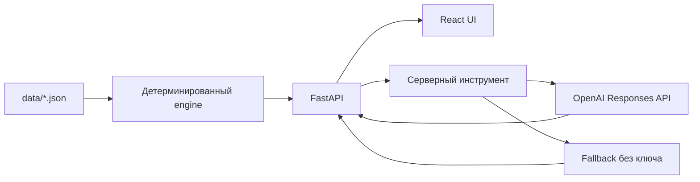

# Аким на 5 часов

AI-симулятор городских решений для хакатона HackAlem AI. Управленец или аналитик распределяет общий виртуальный бюджет между инициативами, выбирает ровно пять мер и видит, как по правилам синтетической модели меняется качество жизни в пяти условных районах Астаны.

Система рассчитывает **Astana Quality of Life Score** детерминированно. AI объясняет уже вычисленный результат, сильные стороны, риски и компромиссы. Без OpenAI-ключа то же действие работает через шаблонное объяснение, собранное из результатов движка.

## Что реализовано

- Одинаковые исходные данные и бюджет **100 условных единиц** для всех пользователей.
- Каталог **14 мероприятий** по транспорту, экологии, социальной инфраструктуре, безопасности и городским сервисам.
- Выбор ровно **5 разных мер**; район обязателен для районной меры. На одно направление допускается не более 2 мер.
- Живой счётчик бюджета. UI не даёт добавить меру сверх бюджета, а API отклоняет любые превышения и остальные нарушения.
- Учёт задержки эффекта, синергий и несовместимостей; показатели и Score меняются при изменении решений.
- Визуализация районных оценок и матрица десяти показателей до и после, выделение значений ниже критического порога.
- Полный перебор **694 395 допустимых наборов**, сравнение с лучшим и предложения допустимых замен одной меры или района.
- Объяснение через OpenAI Responses API с вызовом серверного инструмента; fallback при отсутствии ключа, таймауте или ошибке API.
- Кнопка **«Загрузить пример сценария»** для быстрой проверки.

## Быстрый запуск

Нужен Docker с Compose. В корне проекта выполните:

```bash
docker compose up --build
```

Интерфейс: [http://localhost:8080](http://localhost:8080). Документация API: [http://localhost:8000/docs](http://localhost:8000/docs). Ключ не требуется.

Для AI-объяснений создайте локальный `.env` по образцу `.env.example` и задайте `OPENAI_API_KEY`. Модель настраивается через `OPENAI_MODEL`. Файл `.env` игнорируется Git; ключ никогда не вводится во frontend.

### Запуск без Docker

Нужны Python 3.11+, Node.js 24+ и pnpm 11.19.0. Из корня проекта:

```bash
python -m venv .venv
# Активируйте .venv для вашей ОС
python -m pip install -r backend/requirements.txt
python -m uvicorn backend.api.main:app --reload --port 8000
```

В другом терминале:

```bash
cd frontend
pnpm install --frozen-lockfile
pnpm run dev
```

Откройте [http://localhost:5173](http://localhost:5173). Vite проксирует `/api` к локальному backend. Для production-проверки используйте `pnpm run build` и `pnpm run preview`.

В Windows, если PowerShell блокирует файлы `npm.ps1` или `pnpm.ps1`, используйте `.cmd`-обёртки:

```powershell
cd C:\path\to\hackalem\frontend
pnpm.cmd install --frozen-lockfile
pnpm.cmd run dev
```

Backend и frontend запускаются в разных окнах терминала. Для backend в Windows можно использовать `py` вместо `python`:

```powershell
cd C:\path\to\hackalem
py -m pip install -r backend\requirements.txt
py -m uvicorn backend.api.main:app --reload --port 8000
```

## Как проверить основной сценарий

1. Откройте интерфейс и нажмите «Загрузить пример сценария». Он выбирает M7, M8 и M10 в Нуре, M12 для всего города и M5 в Сарыарке.
2. Убедитесь, что бюджет показывает **95 / 100**, а кнопка расчёта доступна.
3. Нажмите «Рассчитать сценарий». Ожидаемый Score — **56,54** после округления. В таблице видны изменения районов и срабатывание синергии M10+M12.
4. Измените одну меру или район и рассчитайте снова. Score и объяснение должны измениться. Попытка превысить бюджет блокируется; несовместимые меры показывают ошибку.
5. Для API-проверки откройте `/docs` или отправьте `POST /api/simulate`:

```json
{
  "selection": [
    {"measure_id": "M7", "district": "nura"},
    {"measure_id": "M8", "district": "nura"},
    {"measure_id": "M10", "district": "nura"},
    {"measure_id": "M12", "district": null},
    {"measure_id": "M5", "district": "saryarka"}
  ]
}
```

Невалидный набор для `/simulate` и `/explain` получает HTTP 422 с телом `{"errors": [{"rule": "…", "message": "…"}]}`. `/validate` возвращает все найденные ошибки без расчёта Score.

## Как работает модель

В `data/` лежат исходные показатели пяти районов, доли населения, веса, каталог мер, синергии и несовместимости. Все десять показателей имеют шкалу 0–100, где больше — лучше. Горизонт расчёта — **8 кварталов**. Для меры с лагом `L` учтённая доля полного эффекта равна `(8 − L) / 8`.

Для района `d` и показателя `k`:

```text
I'[d,k] = clip(I[d,k] + Σ effect[m,k] × (8 − lag[m]) / 8 + synergy[d,k], 0, 100)
D[d]   = Σ weight[k] × I'[d,k]
D_avg  = Σ population_share[d] × D[d]
Score  = 0.7 × D_avg + 0.3 × min(D[d]) − N_crit
```

`N_crit` — число пар «район × показатель» со значением **строго ниже 40**. Синергия добавляется до `clip` и не масштабируется лагом. Округление применяется только при показе; расчёт идёт с полной точностью. Остаток бюджета не даёт бонуса. Вес слабейшего района не позволяет улучшать лишь благополучные районы.

Эталоны движка:

| Сценарий | Score |
|---|---:|
| Исходное состояние без мер | 52.558 |
| Пример из интерфейса | 56.543 |
| Лучший набор: M2, M3 Нура, M8 Нура, M9 Нура, M14 (стоимость 98) | 57.237 |

Набор без мер — только справочная база. Пользовательский сценарий без пяти мер невалиден и Score не получает. Две меры одного направления разрешены, если направлений не меньше трёх в результате соблюдения лимита.

Пример качественного ответа агента для примерного сценария: он объясняет, что сценарий улучшает выбранные направления, отдельно отмечает эффект синергии M10+M12, указывает на сохраняющиеся слабые места районов и предлагает допустимую замену, если она повышает Score. Числа, Score, стоимость, разрыв с лучшим набором и конкретные замены берутся из результатов детерминированного инструмента; модель не вычисляет их самостоятельно. При отсутствии ключа тот же анализ возвращается проверяемым fallback-шаблоном.

## Архитектура



`backend/engine` отвечает за валидацию, эффекты, Score, вклад мер, сравнение, полный перебор и замены. `backend/api` отдаёт данные и результаты. `backend/ai` передаёт AI проверенные факты через функцию `get_scenario_analysis`; промпт хранится в `backend/ai/prompts/system.md`. Числа и допустимую замену сервер всегда формирует из движка. Модель добавляет только качественный комментарий без чисел и предложений заменить меру; нарушение этого ограничения переводит ответ на fallback. `frontend` показывает данные API и не вычисляет Score.

### Маршруты API

| Метод | Маршрут | Назначение |
|---|---|---|
| GET | `/api/data` | Исходные данные, правила и базовый результат |
| POST | `/api/validate` | Все ошибки выбора |
| POST | `/api/simulate` | Полный детерминированный расчёт |
| POST | `/api/explain` | Анализ, вклады, сравнение с лучшим и замены |
| GET | `/api/best?top_n=5` | Лучшие наборы полного перебора |
| GET | `/api/health` | Проверка доступности |

## Технологии и тесты

Backend: Python 3.11, FastAPI, Pydantic v2, OpenAI SDK, pytest, Ruff. Frontend: React, TypeScript strict, Vite, Recharts. Развёртывание: Docker Compose, Nginx.

```bash
python -m pytest backend -q
python -m ruff check backend
cd frontend && pnpm run build
```

Тесты проверяют каждый класс ошибки валидатора, эталоны Score, синергию, независимость от порядка, число допустимых наборов, худший набор ниже базы, API 422, fallback и вызов инструмента AI. Первый полный перебор на машине разработки занимает десятки секунд; результат кешируется в памяти процесса API.

## Данные, интеграции и ограничения

Данные — подготовленный синтетический набор из задания, без персональных сведений. Единственный внешний сервис — OpenAI API, и он необязателен. Формула и эффекты заданы для демонстрации компромиссов и **не являются прогнозом реального развития Астаны**.

В текущей версии нет учётных записей, сохранения результатов команд, неожиданных событий и автоматической презентации. Кеш оптимизатора сбрасывается при перезапуске backend. Развёрнутой публичной версии пока нет.

Никогда не коммитьте настоящий API-ключ в Git. Заполните `OPENAI_API_KEY` только в локальном `.env`; файл `.env` добавлен в `.gitignore`. Если ключ уже попал в репозиторий или был опубликован, его нужно отозвать и выпустить новый в панели OpenAI.
